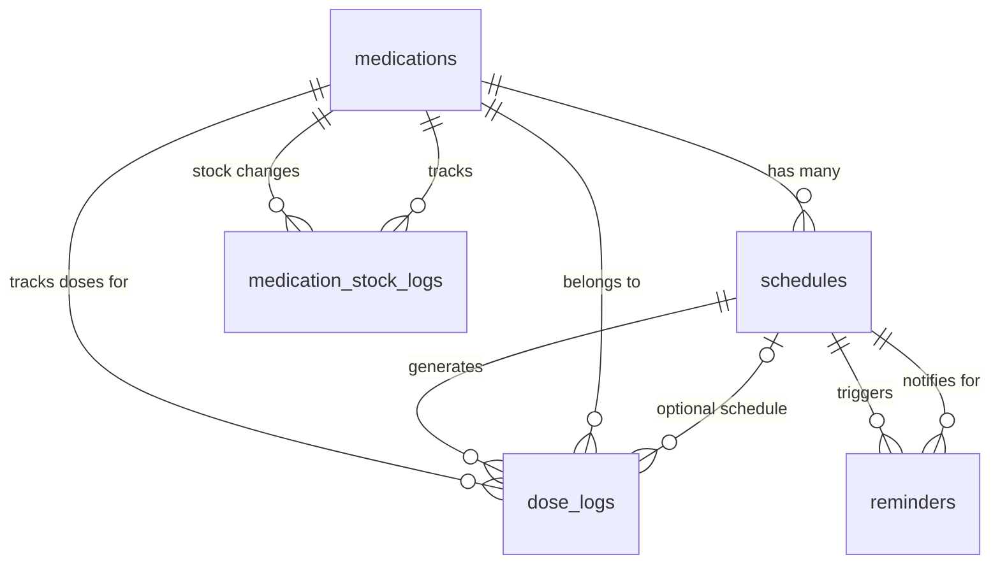

# Dosifi Flutter - Database Structure Analysis

## 📊 Database Overview

**Database Type**: SQLCipher (Encrypted SQLite)  
**Current Version**: 8  
**Database Name**: `dosifi_encrypted.db`  
**Security**: Password-protected with secure key storage using FlutterSecureStorage

## 🏗️ Database Schema

### Core Tables

#### 1. **`medications`** - Medication Inventory Management
```sql
CREATE TABLE medications (
  id INTEGER PRIMARY KEY AUTOINCREMENT,
  name TEXT NOT NULL,
  type TEXT NOT NULL,                    -- MedicationType enum
  brand_manufacturer TEXT,
  strength_per_unit REAL NOT NULL,
  strength_unit TEXT NOT NULL,           -- StrengthUnit enum 
  stock_quantity REAL NOT NULL,          -- Current stock (tablets, mL, etc.)
  reconstitution_volume REAL,            -- For lyophilized vials (mL)
  final_concentration REAL,              -- After reconstitution (mg/mL)
  reconstitution_notes TEXT,
  lot_batch_number TEXT,
  expiration_date TEXT,                  -- ISO8601 format
  description TEXT,
  instructions TEXT,
  notes TEXT,
  barcode TEXT,
  photo_path TEXT,
  is_active INTEGER DEFAULT 1,           -- Boolean flag
  created_at TEXT NOT NULL,              -- ISO8601 timestamp
  updated_at TEXT NOT NULL               -- ISO8601 timestamp
);
```

**Supported Medication Types**:
- `tablet`, `capsule`, `liquid`, `drops`
- `preFilledSyringe`, `readyMadeVial`, `lyophilizedVial`
- `singleUsePen`, `multiUsePen`
- `cream`, `ointment`, `gel`
- `inhaler`, `patch`, `suppository`, `spray`
- `other`

**Strength Units**:
- `mg`, `mcg`, `g`, `ml`, `%` (percent), `IU`, `Units`

---

#### 2. **`schedules`** - Dosing Schedules
```sql
CREATE TABLE schedules (
  id INTEGER PRIMARY KEY AUTOINCREMENT,
  medication_id INTEGER NOT NULL,        -- FK to medications
  schedule_type TEXT NOT NULL,           -- daily, weekly, cycling, etc.
  time_of_day TEXT NOT NULL,             -- HH:mm format
  days_of_week TEXT,                     -- Comma-separated weekdays (1-7)
  start_date TEXT NOT NULL,              -- ISO8601 date
  end_date TEXT,                         -- ISO8601 date (optional)
  cycle_days_on INTEGER,                 -- For cycling schedules
  cycle_days_off INTEGER,               -- For cycling schedules
  dose_amount REAL NOT NULL,             -- Amount per dose
  dose_unit TEXT NOT NULL,               -- Unit (tablet, ml, etc.)
  dose_form TEXT NOT NULL,               -- Form (tablet, liquid, etc.)
  strength_per_unit REAL NOT NULL,       -- Medication strength
  is_active INTEGER DEFAULT 1,
  created_at TEXT NOT NULL,
  updated_at TEXT NOT NULL,
  FOREIGN KEY (medication_id) REFERENCES medications(id) ON DELETE CASCADE
);
```

**Schedule Types**:
- `daily` - Every day
- `weekly` - Specific days of the week
- `cycling` - On/off cycles (e.g., 5 days on, 2 days off)

---

#### 3. **`dose_logs`** - Dose Tracking & History
```sql
CREATE TABLE dose_logs (
  id INTEGER PRIMARY KEY AUTOINCREMENT,
  medication_id INTEGER NOT NULL,        -- FK to medications
  schedule_id INTEGER,                   -- FK to schedules (nullable)
  scheduled_time TEXT NOT NULL,          -- When dose was supposed to be taken
  taken_time TEXT,                       -- When dose was actually taken
  status TEXT NOT NULL,                  -- pending, taken, missed, skipped
  dose_amount REAL,                      -- Actual dose amount taken
  notes TEXT,                            -- User notes
  created_at TEXT NOT NULL,
  FOREIGN KEY (medication_id) REFERENCES medications(id) ON DELETE CASCADE,
  FOREIGN KEY (schedule_id) REFERENCES schedules(id) ON DELETE SET NULL
);
```

**Dose Status Values**:
- `pending` - Scheduled but not yet taken
- `taken` - Successfully administered
- `missed` - Not taken when scheduled
- `skipped` - Intentionally skipped

---

#### 4. **`supplies`** - Medical Supplies Inventory
```sql
CREATE TABLE supplies (
  id INTEGER PRIMARY KEY AUTOINCREMENT,
  name TEXT NOT NULL,
  type TEXT NOT NULL,                    -- item, fluid, diluent
  brand TEXT,
  size TEXT,                             -- "1ml", "25G", "2x2 inches"
  quantity REAL NOT NULL DEFAULT 0.0,    -- Current stock (supports decimals)
  reorder_level REAL,                    -- Reorder threshold
  unit TEXT DEFAULT 'pieces',            -- pieces, ml, liters
  lot_number TEXT,
  expiration_date TEXT,                  -- ISO8601 format
  location TEXT,                         -- Storage location
  notes TEXT,
  is_active INTEGER DEFAULT 1,
  created_at TEXT NOT NULL,
  updated_at TEXT NOT NULL
);
```

**Supply Types**:
- `item` - Countable items (syringes, vials, etc.)
- `fluid` - Volume-based (saline, water for injection)
- `diluent` - Reconstitution solutions

---

### Supporting Tables

#### 5. **`medication_stock_logs`** - Stock Change History
```sql
CREATE TABLE medication_stock_logs (
  id INTEGER PRIMARY KEY AUTOINCREMENT,
  medication_id INTEGER NOT NULL,
  timestamp TEXT NOT NULL,               -- When change occurred
  change_amount REAL NOT NULL,           -- +/- stock change
  new_total REAL NOT NULL,               -- Stock after change
  reason TEXT NOT NULL,                  -- dose_administration, restock, adjustment, etc.
  notes TEXT,                            -- Additional context
  created_at TEXT NOT NULL,
  FOREIGN KEY (medication_id) REFERENCES medications(id) ON DELETE CASCADE
);
```

**Stock Change Reasons**:
- `dose_administration` - Stock reduced due to dose
- `restock` - Stock added
- `adjustment` - Manual correction
- `expiration` - Stock removed (expired)
- `wastage` - Stock lost due to contamination/error

---

#### 6. **`reminders`** - Notification Management
```sql
CREATE TABLE reminders (
  id INTEGER PRIMARY KEY AUTOINCREMENT,
  schedule_id INTEGER NOT NULL,
  reminder_time TEXT NOT NULL,           -- When to send reminder
  notification_id INTEGER NOT NULL,      -- System notification ID
  is_active INTEGER DEFAULT 1,
  created_at TEXT NOT NULL,
  FOREIGN KEY (schedule_id) REFERENCES schedules(id) ON DELETE CASCADE
);
```

---

#### 7. **`reconstitution_recipes`** - Preparation Instructions
```sql
CREATE TABLE reconstitution_recipes (
  id INTEGER PRIMARY KEY AUTOINCREMENT,
  name TEXT NOT NULL,                    -- Recipe name
  powder_amount REAL NOT NULL,           -- Amount of powder (mg)
  powder_unit TEXT NOT NULL,             -- Unit (mg, g)
  solvent_volume REAL NOT NULL,          -- Volume of diluent (mL)
  solvent_unit TEXT NOT NULL,            -- Unit (mL)
  final_concentration REAL NOT NULL,     -- Result concentration (mg/mL)
  concentration_unit TEXT NOT NULL,      -- Unit (mg/mL)
  instructions TEXT,                     -- Step-by-step instructions
  is_favorite INTEGER DEFAULT 0,         -- User favorite flag
  created_at TEXT NOT NULL,
  updated_at TEXT NOT NULL
);
```

---

#### 8. **`user_profiles`** - User Settings & Preferences
```sql
CREATE TABLE user_profiles (
  id INTEGER PRIMARY KEY AUTOINCREMENT,
  name TEXT NOT NULL,
  email TEXT,
  phone TEXT,
  emergency_contact_name TEXT,
  emergency_contact_phone TEXT,
  notification_enabled INTEGER DEFAULT 1,
  theme_mode TEXT DEFAULT 'system',      -- system, light, dark
  language TEXT DEFAULT 'en',            -- Locale code
  created_at TEXT NOT NULL,
  updated_at TEXT NOT NULL
);
```

---

#### 9. **`analytics_data`** - Usage Analytics
```sql
CREATE TABLE analytics_data (
  id INTEGER PRIMARY KEY AUTOINCREMENT,
  metric_type TEXT NOT NULL,             -- dose_compliance, stock_usage, etc.
  metric_value REAL NOT NULL,            -- Numeric value
  metadata TEXT,                         -- JSON metadata
  recorded_at TEXT NOT NULL              -- ISO8601 timestamp
);
```

---

## 🔗 Relationships & Foreign Keys



## 📈 Database Performance

### Indexes for Optimization
```sql
-- Performance indexes
CREATE INDEX idx_medications_name ON medications(name);
CREATE INDEX idx_schedules_medication ON schedules(medication_id);
CREATE INDEX idx_dose_logs_medication ON dose_logs(medication_id);
CREATE INDEX idx_dose_logs_date ON dose_logs(scheduled_time);
```

### Query Patterns
- **Fast medication lookup**: By name, type, or active status
- **Schedule queries**: By medication, date range, active status
- **Dose history**: By medication, date range, status
- **Stock monitoring**: Current levels, low stock alerts, change history

---

## 🔧 Database Migrations

**Current Version**: 8 (Active)

### Migration History:
1. **v1-2**: Basic inventory setup
2. **v2-3**: Enhanced medication schema
3. **v3-4**: Added supplies table
4. **v4-5**: Consolidated stock management
5. **v5-6**: Fixed column naming (number_of_units → stock_quantity)
6. **v6-7**: Enhanced schedules with dose information
7. **v7-8**: Updated supplies schema (category → type, INTEGER → REAL)

### Migration Strategy:
- **Backward compatibility**: Old columns preserved during transitions
- **Data preservation**: All existing data migrated safely
- **Error handling**: Graceful fallback for failed migrations
- **Schema validation**: PRAGMA checks before migrations

---

## 🔒 Security Features

### Database Encryption
- **SQLCipher integration**: Full database encryption at rest
- **Secure key management**: Keys stored in FlutterSecureStorage
- **Unique passwords**: Generated per installation
- **No plaintext storage**: All sensitive data encrypted

### Data Integrity
- **PRAGMA integrity_check**: Database integrity verification
- **Foreign key constraints**: Referential integrity enforced
- **Transaction support**: ACID compliance for data operations
- **Backup functionality**: Encrypted backup creation

---

## 📱 Data Models Integration

### Dart Enums → Database
- **MedicationType**: Stored as TEXT (e.g., 'tablet', 'liquid')
- **StrengthUnit**: Stored as TEXT (e.g., 'mg', 'mcg', '%')
- **DoseStatus**: Stored as TEXT (e.g., 'taken', 'missed')
- **SupplyType**: Stored as TEXT (e.g., 'item', 'fluid')

### Date/Time Storage
- **Format**: ISO8601 strings for universal compatibility
- **Timezone**: UTC for consistency
- **Parsing**: DateTime.parse() / toIso8601String()

---

## 🚀 Performance Characteristics

### Database Size Estimates
- **Medications**: ~1KB per medication
- **Schedules**: ~500 bytes per schedule
- **Dose Logs**: ~300 bytes per log entry
- **Supplies**: ~800 bytes per supply

### Typical Usage Patterns
- **100 medications**: ~100KB
- **500 schedules**: ~250KB  
- **10,000 dose logs**: ~3MB
- **200 supplies**: ~160KB

**Total estimated**: 3-5MB for active user after 1 year

---

## ⚠️ Database Architecture Notes

### Duplicate Model Systems
The codebase contains **two different medication stock management approaches**:

#### 1. **Main Database Schema** (Currently Active)
- Uses simplified `medications` table with `stock_quantity` as REAL
- Generic approach supporting all medication types in one table
- Integrated with current UI and providers

#### 2. **Alternative Stock Models** (Advanced System)
- File: `medication_stock_models.dart` (1,237 lines)
- Type-specific classes: `TabletStock`, `VialStock`, `LyophilizedVialStock`, etc.
- More detailed tracking with medication-specific fields
- **Not currently integrated with database schema**

### Implications
The alternative stock models represent a more sophisticated approach but:
- **Not used** by current database tables
- Would require additional database tables/columns to implement
- More complex but provides better type-specific tracking
- May be intended for future development

## 🧹 Data Cleanup Opportunities

Based on the schema analysis:

1. **Unused stock models**: The `medication_stock_models.dart` file (1,237 lines) contains sophisticated type-specific stock models that aren't used by the current database schema
2. **Unused columns**: Some fields like `photo_path`, `barcode` may be underutilized
3. **Index optimization**: Could add more specific indexes for common queries
4. **Data archiving**: Old dose_logs could be archived after extended periods
5. **Analytics cleanup**: analytics_data table could benefit from retention policies

### Potential Cleanup Actions
- **Remove unused stock models** if not planned for future use (~1,237 lines)
- **Implement advanced stock system** if better tracking is desired
- **Clarify architecture direction** between simple vs. complex stock management

The current database architecture effectively supports the medication tracking rebuild and provides a solid foundation for the application's core functionality.
